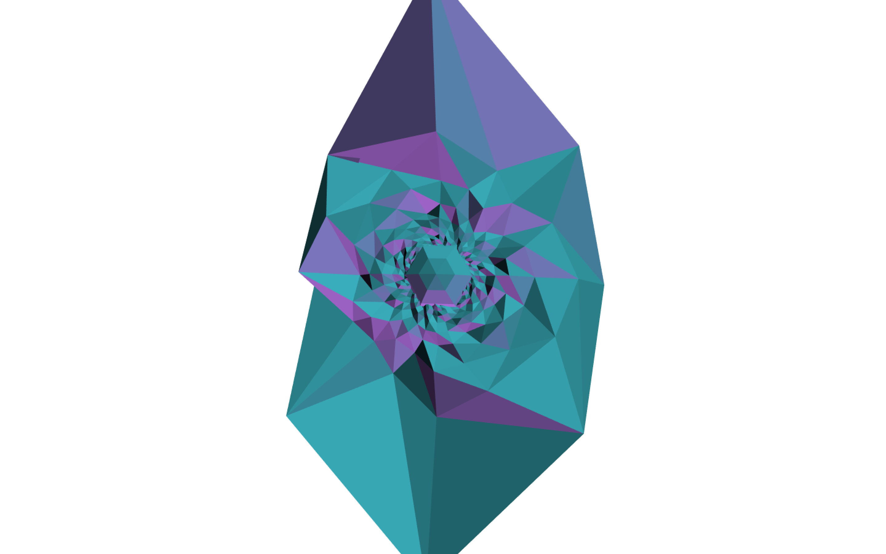
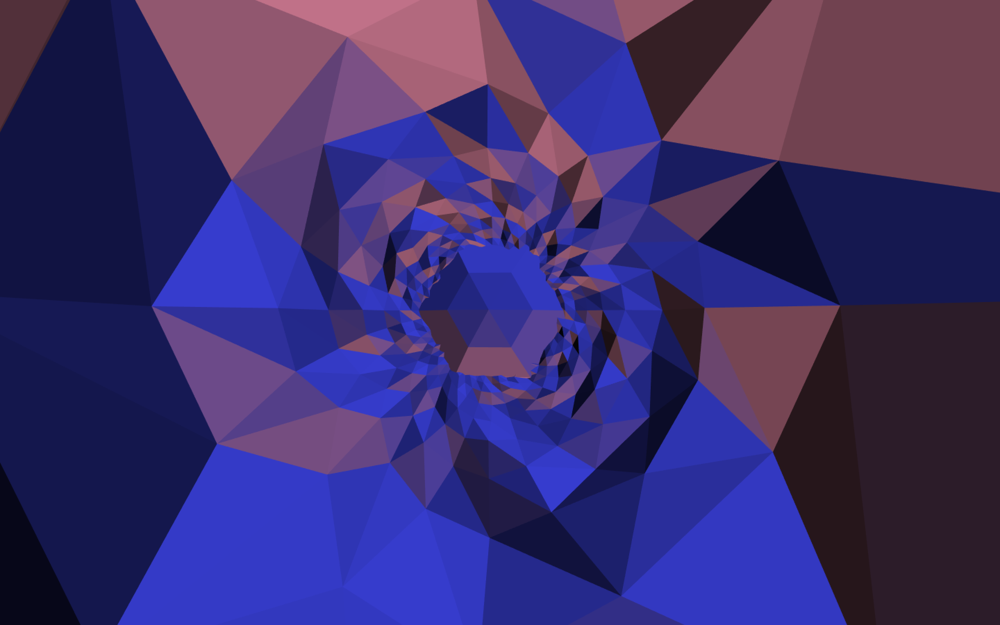
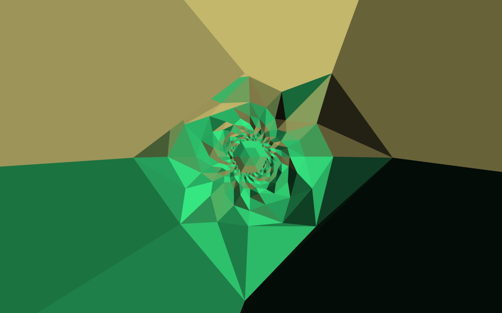
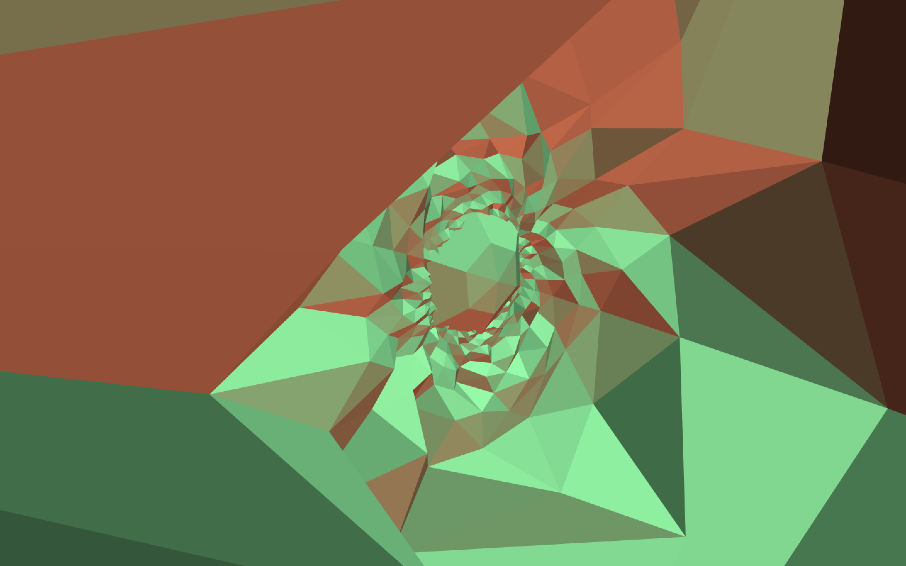

# generative-interaction
An interactive Processing sketch to generate a floral geode with the HE_Mesh library.

## Getting Started
To view this sketch download the [Processing IDE](https://processing.org) and run the sketch. If the libraries from the `code` folder are not detected, simply use the `Import Libary...` tool from the `Sketch` section in the menu bar.

## Controls
Capitalized controls will reverse what the keypress does
`z`: toggles between custom lighting w/ spotlight and random lighting
`r/g/b`: controls rgb values for the direct light
`e/f/v`: controls rgb values for the spotlight
`x`: controls lowerbound of the z-point randomization on the mesh
`c`: controls the upperbound of the z-point randomization on the mesh
`arrow keys`: move the camera left/right
`,/.`: move the camera along z axis
`l/;/'`: rotates the camera along z/y/x axis respectively.
`backspace`: returns everything to default.

## More Screenshots

